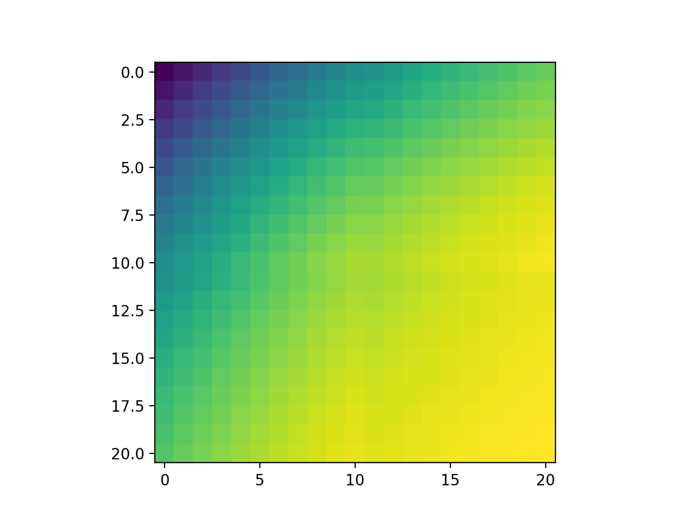
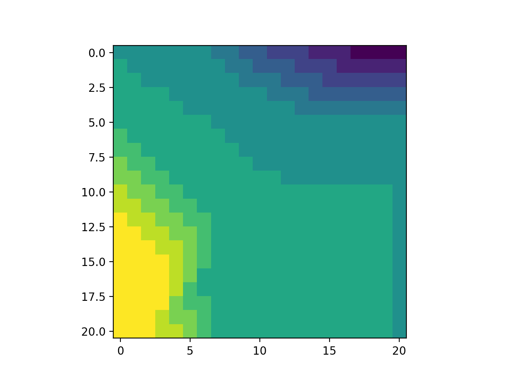

# policy_iteration_car_rental_variant2

Implements a solution to the modified [Jack's Car Rental](http://www.incompleteideas.net/sutton/book/first/4/node4.html) problem in Sutton and Barto - 'An Introduction to Reinforcement Learning',
problem 4.5, and we believe it gives the correct results. We previously implemented the original variant of the problem [here](https://github.com/lucaslingle/policy_iteration_car_rental). 

Here are the final value estimates after four policy improvement iterations:

Here is the final policy produced after four policy improvement iterations:

In the figures above, the value estimates range from 429 to 600 and the policy ranges from -5 to 5.
