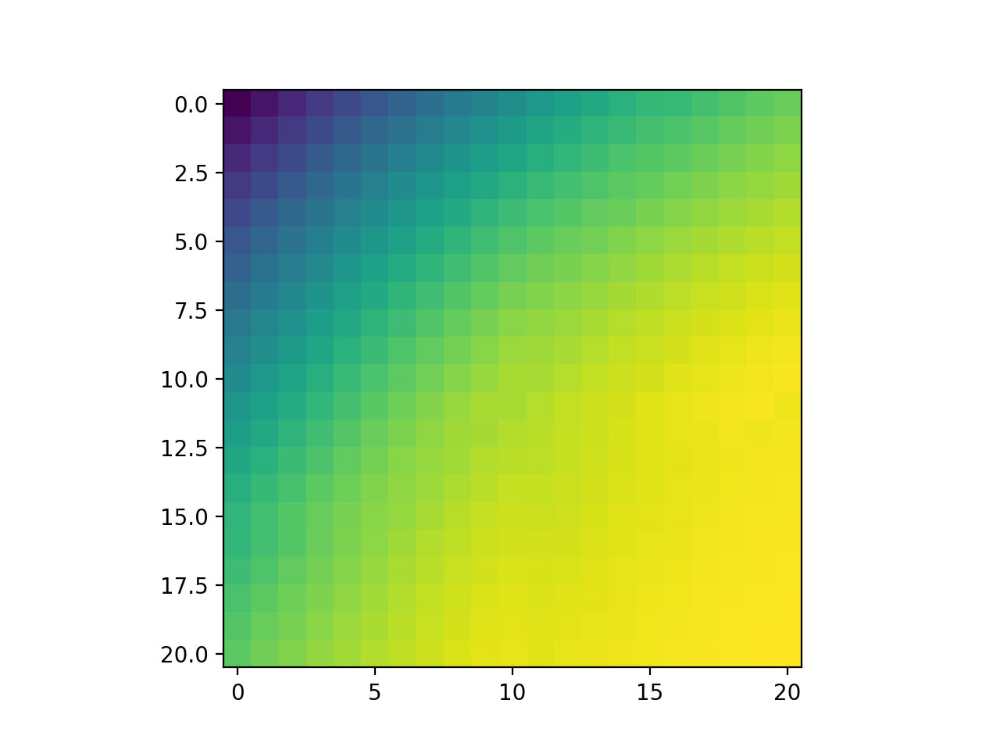
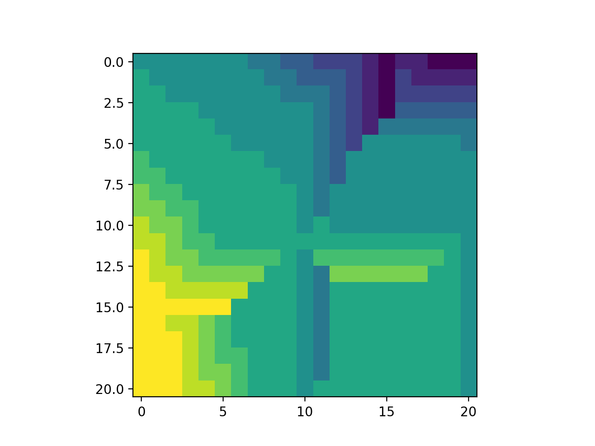

# policy_iteration_car_rental_variant2

Implements a solution to the modified [Jack's Car Rental](http://www.incompleteideas.net/sutton/book/first/4/node4.html) problem in Sutton and Barto - 'An Introduction to Reinforcement Learning',
problem 4.5, and we believe it gives the correct results. 

We previously implemented the original variant of the problem [here](https://github.com/lucaslingle/policy_iteration_car_rental). 

### Figures

Here are the final value estimates after four policy improvement iterations:

Here is the final policy produced after four policy improvement iterations:

In the figures above, the value estimates range from 429 to 603 and the policy ranges from -5 to 5.

### Interpretation

The yellow spike on the left-hand side, jutting towards the center of the grid, has a particularly interesting interpretation. 
It says that if we have 15 cars at store 0, we should always move 5 of them to store 1, if store 1 has between 0 and 5 cars.
This makes sense, since this variant of the problem penalizes having more than 10 cars overnight at any store; moving 5 cars to store 1 allows the policy to avoid a penalty.
Likewise, we can see that for 14 cars at store 0, we should move at least 4 of them to store 1, if store 1 has between 0 and 6 cars.

The vertical line in the middle, towards the bottom half of the grid, says to move zero cars from store 0 to store 1, if there are 11 or more cars at store 0 and 10 cars at store 1.
This can be explained partly by the fact that moving cars at the end of the day would lead to a penalty for both stores if more than 10 were stored overnight. 
